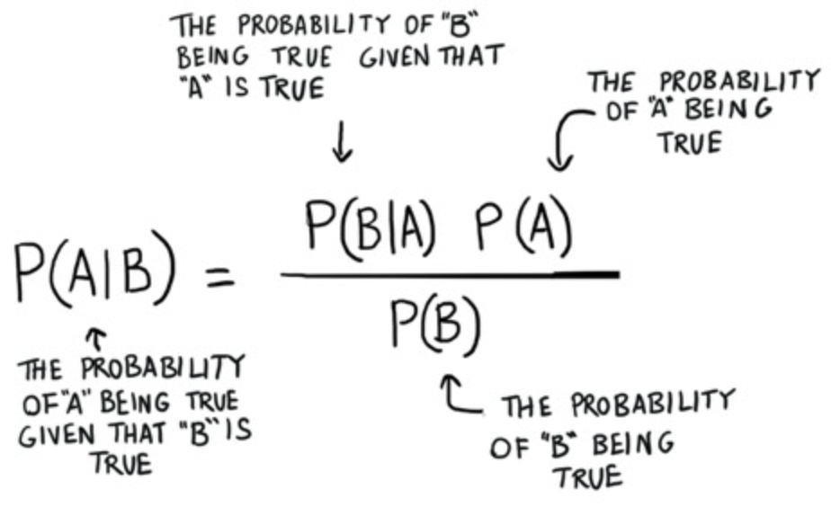

### Questions
* MLE/MAP going into priors
* Learn about Bayesian statistics
* Discuss Baye's theorem and how it's setup
* What is prior probability?
* What is posterior probability? 

### Objectives
YWBAT
* Solve problems involving Bayes Theorem. 
* Define MLE and how we use it in statistics. 

### Outline
* Questions
* Baye's Problems
* MLE discussion
* Wrap UP


```python
import pandas as pd
import numpy as np

import matplotlib.pyplot as plt
```



**Problem 1**

 A hospital has two shifts I and II. Shift I covers 60% of patients and shift II covers 40% of the patients.   Further 2% of the patients covered by shift I are left disgruntled whereas 4% of patients covered by shift II are disgruntled. If a patient is surveyed at random, what is the probability the patient is disgruntled?


```python
# P(Disgruntled|I) + P(Disgruntled|II) -> missing information for the actual probability
# P(Disg|I) -> Probability of being disgruntled given that you are in the first shift
0.60 * 0.02 # this equals the probability that you're in the first shift and disgruntled
0.60 * 0.02 # the total patients (proportionally) that are disgruntled in shift 1
pd1 = 0.02
pd2 = 0.04

# if we take our tree and add everything do we get 1?
# the total probability needs to equal 1.0 because these are all the events

print(0.60*0.98 + 0.60*0.02 + 0.40*0.96 + 0.40*0.04)

print(0.60*0.02 +  0.40*0.04) # 3% prob that a patient is disgruntled given they're chosen at random
```

    1.0
    0.028


```python
# What is the probability that a patient is from shift I given they're disgruntled. 
# P(I|D) = P(D|I) * P(I) / P(D) = 
(0.02*0.60)/0.028
```


    0.42857142857142855


**Problem 2**

There are two identical urns containing respectively 6 black and 4 red balls, 2 black and 2 red balls. An urn is chosen at random and a ball is drawn from it. 

(i) find the probability that the ball is black 

(ii) if the ball is black, what is the probability that it is from the first urn?


```python
# 2i
# 6b/4r 2b/2r

# P(B) = P(U1)*P(B|U1) + P(U2)*P(B|U2)
0.5*0.60 + 0.5*0.5
```


    0.55


```python
# 2ii
# P(U1|B) = P(B|U1) * P(U1) / P(B)
0.60 * 0.50 / 0.55
```


    0.5454545454545454


**Problem 3**

Jerin is getting married tomorrow, at an outdoor ceremony in the woods. In recent years there have only  25 days/yr when it actually rains, the weatherman correctly forecasts rain 90% of the time. When it doesn't rain, he incorrectly forecasts rain 10% of the time.

Given weatherman predicts rain, what is the probability that it will rain on the day of Jerin's wedding?


```python
# Probability the weatherman predicts rain
25/365 * 0.90 + 340/365 * 0.10
```


    0.1547945205479452


```python
# P(R|PR) = P(PR | R) * P(R) / P(PR) 
0.90 * 0.068 / 0.15
```


    0.40800000000000003


### What is MLE?

### What is MLE Used for?

- Used in predictive machine learning. 
- Used to find parameters of a model. 
- Used in clustering and classification
- Used to find parameteres of distributions
    - What are the parameters of a normal distribution?
        - mean and standard deviation
    - What is the parameter for a poisson distribution?
        - lambda - the event rate
    - What is the parameter of an exponential distribution?
        - lambda - growth/decay rate
        

### What did you learn?
* What MLE is used for
* Learned that tree maps are pretty dank
* Intuition behind probability calculations
* Correctly reading bayesian formula and terminology
* Getting familiar using the equations
* The recap on the distribution parameters


```python

```
